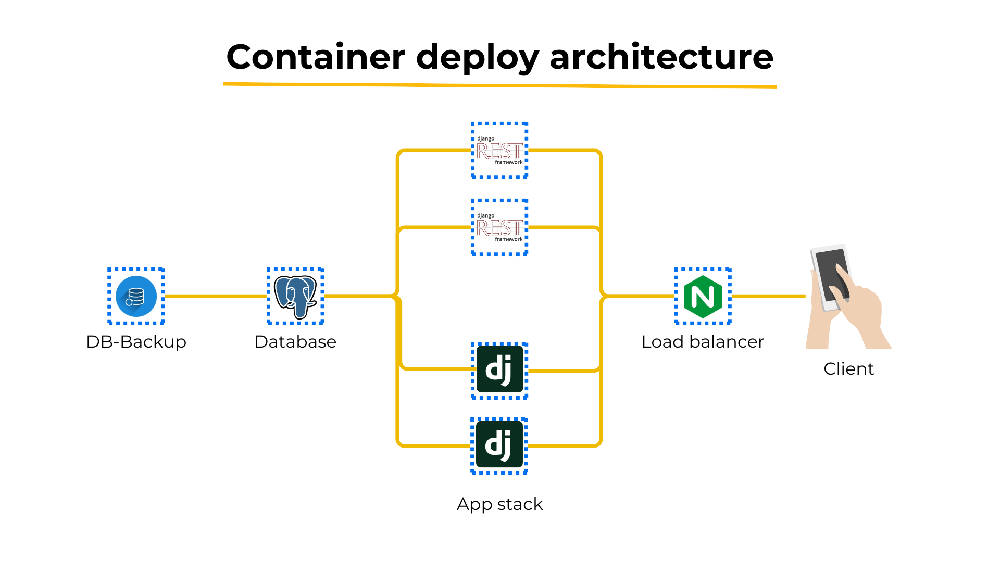

# Atcho backend

Atcho-backend is the backend core for the Atcho moobile app, providing essential functionality and services to support the application.

## Description

This project serves as the backbone for the Atcho app, handling core functionalities and providing a robust backend infrastructure. It is built with Python, Django 4.2.7, and employs various technologies to ensure seamless operation.

## Technologies Used

- **Python**: The primary programming language for the project.
- **Django 4.2.7**: A high-level Python web framework for rapid development and clean, pragmatic design.
- **Rest API**: DJANGO Restfull api.
- **PostgreSQL**: A robust relational database management system used to store and retrieve data.

## Getting Started

### Prerequisites

Make sure you have the following installed:

- [Python](https://www.python.org/)
- [Django 4.2.7](https://www.djangoproject.com/)
- [PostgreSQL](https://www.postgresql.org/)
- 



### Installation

1. Clone the repository:

    ```bash
    git clone https://github.com/TheZoldycs/atcho-backend
    cd atcho-backend
    ```

2. Install dependencies:

    ```bash
    pip install -r requirements.txt
    ```

3. Run migrations:

    ```bash
    python manage.py migrate
    ```

4. Start the development server:

    ```bash
    python manage.py runserver
    ```


